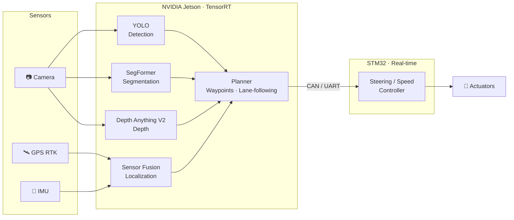

<!-- ============================== HEADER ============================== -->
<div align="center">


<a href="https://git.io/typing-svg">
  
</a>

<p>
  <a href="mailto:hoanganh2282003@gmail.com"></a>
  <a href="https://www.facebook.com/phan.hoanganh.562/"></a>
  <a href="https://github.com/hoanganhidi0822"></a>
  
</p>

</div>

---

## `$ whoami`

I'm a **Control & Automation Engineering** student building autonomous systems that run on **real hardware**, not just in simulation. My work spans the full robotics stack — from **multi-sensor fusion** and **edge AI perception** to **motion control** and **embedded firmware** — on platforms like **NVIDIA Jetson** and **STM32**.

I care about systems that are *practical, deployable and real-time*: models that are quantized and optimized for the edge, firmware that is deterministic, and pipelines that survive outdoor conditions.

```cpp
struct Engineer {
    const char* name     = "Phan Van Hoang Anh";
    const char* major    = "Control & Automation Engineering";
    const char* focus[4] = { "Autonomous Driving", "Embedded AI",
                             "Sensor Fusion",      "Real-time Control" };
    const char* hardware[4] = { "Jetson AGX Orin", "Jetson Orin Nano",
                                "STM32",           "ESP32" };
    const char* motto    = "If it doesn't run on hardware, it isn't done.";
};
```

---

## 🧭 Engineering Focus

<table>
<tr>
<td width="50%" valign="top">

#### 🚗 Autonomous Driving
End-to-end autonomy pipelines: perception, localization, lane-following and steering control on a real outdoor vehicle.

#### 👁️ Edge AI Perception
Detection, segmentation and monocular depth (**YOLO**, **SegFormer**, **Depth Anything V2**) optimized with **TensorRT** for Jetson.

</td>
<td width="50%" valign="top">

#### 🛰️ Multi-Sensor Fusion
Fusing **GPS RTK**, **IMU** and **camera** data for robust outdoor localization and navigation.

#### ⚙️ Embedded & Real-time Control
Deterministic firmware on **STM32 / ESP32**, glitch-free PWM, motor control and bus communication (**CAN, UART, SPI, I²C**).

</td>
</tr>
</table>

---

## 🛠️ Tech Stack

<div align="center">

**Languages**


**AI · Perception**


<br/>


**Robotics · Platforms**


<br/>


**Embedded**


<br/>


**Tooling**


</div>

---

## 🚀 Featured Work

### 🏌️ Autonomous Golf Cart Platform
> Outdoor autonomous navigation deployed on a **real electric golf cart**.

| Layer | What it does | Stack |
|---|---|---|
| **Perception** | Object detection, drivable-area segmentation, monocular depth | YOLO · SegFormer · Depth Anything V2 · TensorRT |
| **Localization** | Centimeter-level global positioning + orientation | GPS RTK · IMU |
| **Planning** | Waypoint navigation and lane-following | Python · C++ · ROS 2 |
| **Control** | Steering and speed actuation on the vehicle | STM32 · CAN / UART |
| **Compute** | On-board real-time inference | Jetson AGX Orin |



### ⚡ Embedded Motor Control
> Real-time motor handling on **STM32** for robotics applications.

- Glitch-free PWM generation with safe duty-cycle updates
- Deterministic, interrupt-driven control loops
- Communication with high-level compute over serial / CAN

---

## 📊 GitHub Analytics

<div align="center">


</div>

---

## 🎯 Currently

- 🔭 Improving robustness of outdoor perception and localization on the golf cart platform
- ⚡ Squeezing more FPS out of Jetson with TensorRT (FP16 / INT8) optimization
- 🌱 Going deeper into state estimation, control theory and ROS 2
- 🤝 Open to collaboration on **autonomous vehicles, robotics and edge AI** projects

---

<div align="center">

**Let's build something that moves.** 🤖

<a href="mailto:hoanganh2282003@gmail.com"></a>


</div>
